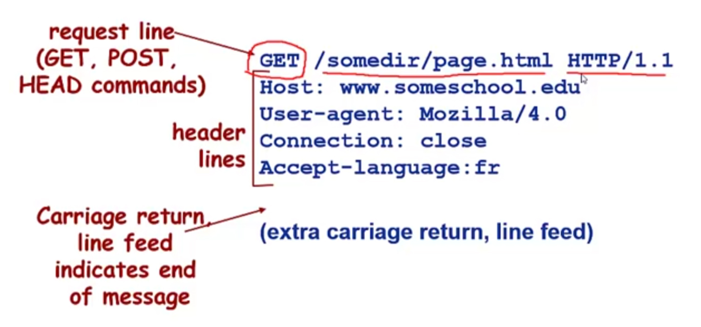

# 基础知识
1. char和TCHAR：TCHAR在Unicode模式下，是wchar_t\*类型的数组；在ANSI模式下，是char\*类型的数组
2. _tmain是VS的C++程序的入口点

# 代码解读
1. `InitSocket()`函数
   1. 使用`WSAStartup()`初始化Socket API
   2. 使用`socket()`创建代理套接字，返回描述符至`ProxyServer`，用于接收客户端连接
2. `ProxyThread()`函数
   1. 使用`recv()`接收客户端的数据
   2. 使用自定义函数`ParseHttpHead()`解析HTTP头信息
   3. 使用自定义函数`ConnectToServer()`建立与目标服务器的连接
   4. 使用`send()`将请求转发到目标服务器
   5. 使用`recv()`接收服务器的响应
   6. 使用`send()`将响应返回给客户端
3. `ParseHttpHead()`函数
   1. 解析HTTP请求消息的HTTP头部（ASCII码格式），解析后存入HttpHeader结构体中
   2. 
4. `ConnectToServer()`函数
   1. 解析主机名为IPV4地址，并创建套接字与目标服务器建立连接

# VSCode调教
1. 点击右上角的`运行C/C++文件`
2. 调试配置根据你的文件选择，C文件使用gcc编译，C++文件使用g++编译
3. 在`.vscode/task.json`中的`args`中添加编译命令参数`"-lws2_32"`，以链接到 Windows Socket API 库（Ws2_32.lib）
4. 再次点击`运行C/C++文件`，此时会开启一个终端，执行一个命令，该命令编译C++文件并生成.exe程序，同时运行.exe程序
5. 这个时候`运行C/C++文件`和`调试C/C++文件`就都可以使用了

# 其它问题
1. 所有操作系统都有127.0.0.1这个IP地址，即localhost地址